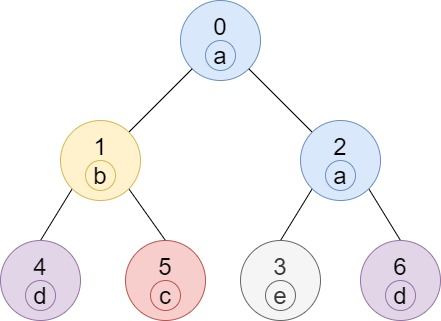

# Количество узлов

https://leetcode.com/problems/number-of-nodes-in-the-sub-tree-with-the-same-label/

### Сложность

Средняя

### Условие задачи

Дано дерево (т.е. связный неориентированный граф, не имеющий циклов), состоящее из n узлов с числом от 0 до n - 1 и ровно n - 1 ребер.<br>
Корнем дерева является узел 0, и каждый узел дерева имеет метку, которая представляет собой символ нижнего регистра,
указанный в строковых метках (т.е. узел с номером i имеет метку labels[i]).

Ребра заданы как массив, где edges[i] = [ai, bi], что означает наличие ребра между узлами ai и bi в дереве.

Верните массив размера n, где ans[i] - количество узлов в поддереве узла i, которые имеют ту же метку, что и узел i.

Поддерево дерева T - это дерево, состоящее из узла в T и всех его дочерних узлов.

### Примеры

---



Ввод:
```
n = 7
edges = [[0,1],[0,2],[1,4],[1,5],[2,3],[2,6]]
labels = "abaedcd"
```
Вывод:
```
[2,1,1,1,1,1,1]
```

---


Ввод:
```
n = 4
edges = [[0,1],[1,2],[0,3]]
labels = "bbbb"
```
Вывод:
```
[4,2,1,1]
```

---


Ввод:
```
n = 5
edges = [[0,1],[0,2],[1,3],[0,4]]
labels = "aabab"
```
Вывод:
```
[3,2,1,1,1]
```